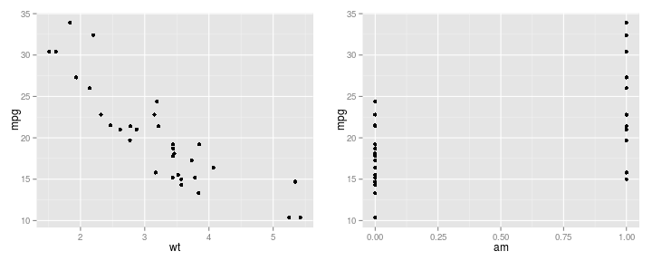

---
title       : Prediction
subtitle    : Predicting MPG based on Weight and Transmission type
author      : 
job         : 
framework   : io2012     # {io2012, html5slides, shower, dzslides, ...}
highlighter : highlight.js  # {highlight.js, prettify, highlight}
hitheme     : tomorrow      # 
widgets     : []            # {mathjax, quiz, bootstrap}
mode        : selfcontained # {standalone, draft}
knit        : slidify::knit2slides
--- {class: class1, id: id1, bg: lightyellow}

## Goal

* Predict MPG using weight and transmission type

* mtcars dataset is used to train the model

* A simple linear model

* Use the model to predict for new observations

--- {class: class1, id: id1, bg: lightyellow}

## Correlation Plot


```r
data(mtcars)

mpg_plot <- ggplot(mtcars, aes(x = wt, y=mpg)) + geom_point()

wt_plot <- ggplot(mtcars, aes(x = am, y=mpg)) + geom_point()

multiplot(mpg_plot,wt_plot, cols=2)
```

 

--- {class: class1, id: id1, bg: lightyellow}
## Model

```r
fit <- lm(mpg~wt+am, data=mtcars)

fit
```

```
## 
## Call:
## lm(formula = mpg ~ wt + am, data = mtcars)
## 
## Coefficients:
## (Intercept)           wt           am  
##    37.32155     -5.35281     -0.02362
```

--- {class: class1, id: id1, bg: lightyellow}
## Conclusion

* The weight turns to be significant factor in determining the MPG

* We have build a web page where we can provide new observations and predict the MPG

* https://cvsekhar.shinyapps.io/dataproduct/


